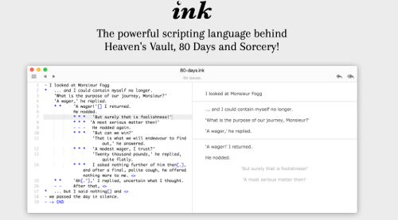

# Chapter 2: Installing and Using the Inky Editor

Writing Ink can take place in any program that can handle text, but the Inky Editor, put out by the creators of the Ink programming language, Inkle Studios, helps by not only providing ways to check for potential issues with the code, but also runs a story as it is written.

In this chapter, you will learn where to find the Inky Editor, how to install and use it, and some basics like opening and saving Ink files while editing them.

## Why use the Inky editor?

Ink can be written in anything that can handle text. Some authors prefer to work in their favorite text editor and only move to another tool when it is time to create a compiled, final product. The choice, as always, is up to individual authors. However, the Inky Editor has something most other text editing programs do not: the Preview pane.

When writing Ink using the Inky Editor, the code will be previewed on the right-hand side. Every time there is a stop in writing, the code preview will be updated and the compiled product shown to the user. This helps in not only seeing how the code will look when run, but the previewing area allows for rewinding through choices and restarting the story, providing a quick way to see how taking other paths through the story might also look to a player.
Installing Inky

The Ink webpage has a link to the Inky editor. Scroll down the page and click on the “Download” button under the name Inky. 

[Image of Inky and Download Link]

Builds exist for Windows, Mac, and Linux systems and can be found on the Releases page for the product on GitHub. Always download the most-current build to get the newest features and bug fixes.
Windows

[Picture of Windows ZIP file]

When downloaded in Windows, Ink will be in a ZIP file. Uncompress the ZIP file and look for the Ink.exe executable file. Running this will open the Inky Editor.
MacOS X

[Picture of MacOS X DMG]

For MacOS X users, Inky will be in a DMG file. These can be opened and the Inky application moved into the Applications directory. Run Inky from inside the Application directory or directly from the Launchpad.
Using the Inky Editor

[Image of the empty Inky Editor]

When opened, the Inky Editor will show two main panes. The first, on the left, is where the code is written. As it is run by the editor, the results will be previewed on the right pane.
Opening an Ink File

[Image of File → Open in Inky]

Existing Ink files can be opened through the File menu and going to File → Open. Any Ink files can be opened this way and will be loaded in the Editor with their code on the left and the previewed results of the code on the right.
Saving an Ink File

[Image of File → Save Project]

A collection of Ink files is called a project. Even if a project only contains one file, it can still be saved through the File → Save Project menu option.
Creating a New Project

[Image of File → New Project]

A new project can be created through going to File → New Project. This will open a new window of the Inky Editor.

By default, Inky will list all current Ink files in the same directory of a newly created and saved Ink project.
Adding a New Included Ink File

[Image of File → New Included Ink File]

To more directly add a new Ink file to an existing project, the File → New Included Ink File option can be used. It will prompt what to name the file and then add it to the project.
Working with an Inky Project

Above the Preview pane where the Ink story is being run are two buttons: Rewind a Single Choice and Restart a Story.

The Preview pane will always show the End of Story as well. This is the true ending and is added when an author does not explicitly add it.
Rewind a Single Choice

[Image of Rewind a Single Choice button]

While a story is being run, the Inky editor remembers each choice. At any point, these choices can be rewound by a single group of choices to the last previous position in the story. 
Restart a Story

[Image of Restart a Story button]

Similar to the Rewind a Single Choice button, the Restart Story button rewinds a story back to the first set of choices.

## Try it!

Let’s practice working with Ink files.

First, make sure you have downloaded the Inky Editor making your operating system. Open the Inky Editor.

Write the following in the code pane:

`Greetings, Universe!`

Over in the Preview pane, the results of the code will be shown.

[Image of “Greetings, Universe!”]

Be default, the name of a new Ink project is "Untitled.ink". Let’s change that by saving the project with a new name.

Choose "Save Project" from the File menu. File → Save Project.

[Image of Save Project option]

In the Save As filed, name this file "Chapter2.ink", select a location to save the file, and then click the "Save" button.

The Inky Editor will update its name to the new file. The project is now called "Chapter2.ink".

Congratulations on creating a new file, adding code, and then saving it!

